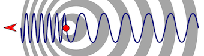

# (PART) Cosmology {-}

```{r cosmo-tikz-setup, echo=FALSE, include=FALSE}
knitr::read_chunk(here::here("inst/Resources/diagrams/cosmology.Rmd"))
```

`r geovizr::chapter_image("pictures/Cosmology/1__head")`
# The Universe

> *Two things are infinite: the Universe and Human Stupidity; and I'm not sure about the Universe.*
>
> `r tufte::quote_footer('--- Albert Einstein')`

## The origin of a theory
\index{Big Bang theory}

Until the beginning of the 20^th^ century, the consensus was that the Universe is static. Most models were limited to our galaxy. Today the most widely accepted theory is called the *Big Bang theory*. It explains the beginning of our Universe and its evolution. It is based on an expanding Universe.

At the beginning of the 20^th^ century the ever-better telescopes allowed astronomers to observe a phenomenon called the *red shift* (see box \@ref(prp:cosmo-redshift)). Basically, some of the objects observed in space were slightly redder than they ought to be. This observation quickly led to the conclusion that those objects are moving away from us. In order to explain this observation, a new theory was necessary.

It is a Belgian Priest, Father Georges Lemaître who first proposed a theory of a Universe that originated with the "Blast of Giant Atom". Without knowing about Hubble's observation, Lemaître working with Einstein's equations of general relativity formulated the basis of what would later become the *theory of the Big Bang* [@perricone_big_2009, pp. 19-22].

:::: {.flbox data-latex=""}
::: {.proposition #cosmo-redshift name="Concept: Redshift"}
\index{Redshift}
When an ambulance comes towards you, the siren has a higher pitch than when that ambulance passes you by and moves away from you. The pitch of the siren goes from high to low.
		
\index{Doppler effect}
This change of pitch is called the **doppler effect**. When the ambulance comes towards you the sound of the siren travels faster. The wavelengths are compressed (see figure below) and the sound has a higher pitch. When the ambulance moves away it's the opposite effect.

```{r doppler-effect, opts.label='fig', out.width="80%", fig.align='center'}

```

*The doppler effect*^[Source: [Wikimedia](https://commons.wikimedia.org/wiki/File:Doppler_effect_diagrammatic.png).]

Something similar was observed by astronomer Edwin Hubble in the 1920s. When studying the lights from other galaxies he observed that almost all of them appear to be shifted towards the red end of the light spectrum. This effect was called the **redshift**. He realised that the galaxies that are the furthest away from us are the ones moving away at the highest speed [@perricone_big_2009, pp. 16-18].

:::
::::


## A timeline of the Big Bang
\index{Big Bang theory!Timeline}

The fundamental elements haven't changed since Lemaître and Hubble. Our understanding of the first instants of the Universe has, however, improved vastly in the last century. The evolution of the Universe can be divided into different stages. We will look at the main steps from the initial instant to the formation of galaxies.

### The Planck Era

Before 10^-43^ seconds after the Big Bang, scientists are unable to explain what happened. This first period is called the Planck Era. There are different models each with different scenarios for this first era. No consensus has been reached and we might never have a clear understanding of this first instant [@perricone_big_2009, pp. 67-69].

### The Expansion

Right after the Planck Era the Universe has a temperature of 10^32^ Kelvins. The fast expansion of the Universe is cooling it rapidly. During this early expansion the fundamental forces "*froze out*". First gravity and then the strong nuclear force separated. Finally, the weak nuclear force separated from the electromagnetic force. After the rapid expansion, the Universe is at a temperature of 10^15^ Kelvins [@perricone_big_2009, pp. 69-71].

### The Primordial Soup

At a temperature of 10^12^ Kelvins, 10^-12^ seconds after the Big Bang, the Universe is one big soup of plasma. The first fundamental particles start to appear. Matter and antimatter exist in equal amount. For some, yet unexplained reason, matter ends up dominating [@perricone_big_2009, p. 71].

### The nucleosynthesis

A few seconds after the Big Bang the Universe is cool enough (less than 10^10^ Kelvins) for the first atomic nuclei to form. Atoms of hydrogen and helium make up most normal matter formed at that point (99,99% of all the atoms) and hydrogen dominates (about 90%). The first light becomes visible and is observable today as the *cosmic background radiation* \citep[72-73]{perricone_big_2009}.

### The first atoms

It's only 380'000 years after the Big Bang that temperatures cool to below 3000 Kelvins. At that temperature, the hydrogen and helium nuclei capture electrons and atoms start to form. Variations in the density of the universe create pockets of gas that will later form the galaxies [@perricone_big_2009, p. 73].

### The Stars and Galaxies

It will take half a billion years for the pockets of gas to form stars. Those stars in turn organise in large  clusters we call galaxies. The galaxies take different shapes. Most of them are either elliptical or spiral. The elliptical galaxies show little rotation and no longer form new stars. The spiral galaxies like our *Milky Way* have a large amount of gas and active star formation [@perricone_big_2009, p. 78].


`r geovizr::chapter_image("../Resources/pictures/Cosmology/2__head")`
# The Solar System

> *I think we have a good chance of surviving long enough to colonise the solar system.*
>
> `r tufte::quote_footer('--- Stephen Hawking')`

## The birth of our Solar System
\index{Solar System}

Our Solar System is approximately 4.6 Billion years old. Before that everything in the Solar System existed as a giant cloud of raw material. This cloud is mainly composed of hydrogen and helium with some traces of heavier elements. Over millions of years, a "Solar Globule" forms in this cloud and starts to grow. This is the beginning of what will later become our Sun.

Roughly 40 million years after the formation of the Solar Globule, our Sun reaches its main-sequence state. At that moment the temperature at the core is sufficient for a fusion of the hydrogen nuclei and the formation of helium. This fusion is what generates the Solar energy. Today the Sun is almost halfway through the main sequence.

While the Sun was forming, further out in the cloud protoplanets were starting to appear. The gas-giant Jupiter and Saturn were the first to form, which explains their larger size. The ice giants Uranus and Neptune are further out in the cloud and have taken longer to reach a size allowing them to stockpile gas.

The terrestrial planets formed last. Compared to their bigger counterparts, the terrestrial planets formed quite rapidly. They cleaned up the region closest to the Sun of the rock and dust that was still floating there. Venus and Earth ended up with approximately the same mass; Mercury and Mars are much smaller though [@garlick_story_2002, pp. 8-43].

## The main objects

All data about the objects comes from @garlick_story_2002 and @spohn_encyclopedia_2014.

### Our Star
\index{Sun}

```{r cosmo-info-sun, opts.label='geo.cosmo.box'}
geovizr::gvz_cosmo_solar_system_object("Sun")
```

Our Sun is a yellow dwarf star. It is composed of approximately 71% of hydrogen and 26% of helium. The rest is mainly oxygen carbon, nitrogen, neon and iron. All those elements are present in the Sun in a gaseous, ionised formed we call plasma.

At the core of the Sun the temperature reached 15 million Kelvin. This temperature allows the hydrogen nuclei to fuse together to form helium. It's this fusion that generates the Sun's heat and light. Without this process, life on Earth would be impossible.

### A planetary debate

Before discussing the planets of our Solar System, we have to define the term "planet". For the ancient Greek, a Planet was a "wanderer of the sky"; and until the discovery of large objects in orbits similar to that of Pluto there was no debate about an exact definition of the term. The prospect of adding maybe dozen of new planets to the list prompted the IAU^[International Astronomical Union, it is the recognised authority for naming celestial bodies.] to review the definition of what we call a planet.

After a lengthy debate, the IAU came up with the following definitions:

```{definition cosmo-planet-definition, echo=TRUE, name='Planet'}
A planet is an astronomical object that orbits a star and:

- is massive enough to be rounded by its own gravity;
- is not massive enough to cause thermonuclear fusion;
- has cleared its orbit of other objects.

```

```{definition cosmo-dwarf-planet-definition, echo=TRUE, name='Dwarf planet'}
A dwarf planet is an astronomical object that orbits a star and:

- is massive enough to be rounded by its own gravity;
- hasn't cleared its orbit of other objects.

```

### The rocky planets
\index{Planet!Terrestrial planets}

The inner zone of the Solar System has four terrestrial planets. They are small compared to the gaseous ones. They all have solid surfaces and their density are higher than those of the gas giants.

```{r cosmo-info-mercury, opts.label='geo.cosmo.box'}
geovizr::gvz_cosmo_solar_system_object("Mercury")
```
\index{Planet!Mercury}

The tiny one. The smallest planet of the Solar System, it is little more than a barren rock. Closest to the Sun, this planet never had any real atmosphere. There is also no water on Mercury. The absence of water and atmosphere means that there is no surface erosion. Just like Earth's Moon the planet's surface shows marks of every impact the planet has suffered in its history.

Mercury has the second-highest density in the Solar System. This high density is due, according to some astronomers, to a very large impact early in the planet's history. This cataclysmic event might have cost Mercury a great amount of mass but it might explain why Mercury has such a high density. After the collision only the heavier elements, mainly iron, would have remained at the core of the planet.

```{r cosmo-info-venus, opts.label='geo.cosmo.box'}
geovizr::gvz_cosmo_solar_system_object("Venus")
```
\index{Planet!Venus}

Hell. It's only slightly smaller than Earth but the similarity ends there. Venus is the planet with the hottest surface temperature in the Solar System (around 480 K). Venus's atmosphere is mainly composed of carbon dioxide (96.5% by volume), nitrogen and some sulphur dioxide, hydrogen and water vapour. Besides the presence of highly corrosive sulphuric acid, the atmosphere is also extremely dense. This means that at the surface the atmospheric pressure is almost a 100 times that of Earth.

Venus is the only planet to have a retrograde rotation. This means that when viewed from above (above is defined as Earth's north pole), Venus rotates in a clockwise direction when the other planets rotate counterclockwise. Its rotation speed is very small, the consequence being that a Venus day is longer than a Venus year.

```{r cosmo-info-earth, opts.label='geo.cosmo.box'}
geovizr::gvz_cosmo_solar_system_object("Earth")
```
\index{Planet!Earth}

The pretty blue one. For now it's the only place in the Solar System where we find life. Earth is situated in what is called the Goldilocks zone. The perfect distance from the Sun to allow the presence of liquid water at the surface. Almost three quarter of our home is covered with oceans. The atmosphere is composed of 78% of nitrogen and 21% of oxygen. The carbon dioxide that made Venus such a terrible place is only present in trace amounts.

Earth is unique among the terrestrial planets. Not only because of the oceans and the presence of life. Earth has many features that set it apart from the other rocky planets. It is the only planet with an active tectonic plate system. The plate movements are most certainly made possible by the oceans that serve as a lubricant. Another special attribute of our planet is its large satellite. None of the other rocky planets has any spherical satellite. The best explanation for the origin of the Moon is a large collision with a protoplanet at the beginning of the formation of our planet. This massive event sent large quantities of the earth mantle into space but they remained in orbit around the planet and slowly accumulated to form the Moon.

```{r cosmo-info-mars, opts.label='geo.cosmo.box'}
geovizr::gvz_cosmo_solar_system_object("Mars")
```
\index{Planet!Mars}

The red planet. Mars is much smaller than Earth and further away from the Sun. Nonetheless, it's the best candidate for colonisation in our Solar System. Mars has a rotation period of slightly longer than that of Earth, a very thin atmosphere of carbon dioxide and an average surface temperature of -23° Celsius. While these aren't ideal condition for life, Mars is still the best candidate among the terrestrial planets. Mars also has frozen water in large quantities at the poles.

Phobos and Deimos are the two moons of Mars. They are small peanut-shaped bodies; nothing more than asteroid captured by Mars at some point. Phobos has a diameter of 27 kilometres.

### The Asteroid Belt
\index{Asteroid Belt}

Between the small rocky planets and the large gas giants is a region of space filled with what could be considered "space debris". This belt of small objects is called the Asteroid Belt. Composed of a large number of peanut-shaped rocks, it contains a one spherical body: the dwarf planet Ceres\index{Dwarf Planet!Ceres}. The asteroid belt extends from approximately 2 AU to 3.3 AU. The relative proximity to Jupiter and its gravitational influence might explain why the objects of the Asteroid have never formed a larger body.

### The giant planets
\index{Planet!Gas giants}

After the Asteroid Belt come the four gas giants. Several times larger than the terrestrial bodies, the gas giants all have large quantities of gas, chiefly hydrogen and helium.

```{r cosmo-info-jupiter, opts.label='geo.cosmo.box'}
geovizr::gvz_cosmo_solar_system_object("Jupiter")
```
\index{Planet!Jupiter}

The failed Star. Jupiter is the largest planet and also has the largest mass among planets. Its composition is close to that of the Sun. Its formation is probably closer to that of a planet than a Sun. Like all gas giants, Jupiter has no solid surface. The atmosphere is arranged in bands also called tropical regions. The lighter "white" bands are thought to be places where an upwelling is taking place. Jupiter's atmosphere also features some intense storms. Probably the best known is the Great Red Spot. This "permanent" storm has been on Jupiter for more than a hundred years and possibly far longer than that. Astronomers don't have a good explanation for this feature of Jupiter's atmosphere.

Besides its planetary features, Jupiter also has a very large system of moons. There are 79 known satellites. Of those 79, four are large spherical bodies. They are called the Galilean moons: Io, Europa, Ganymede and Callisto. Ganymede is the largest satellite in the Solar System (about 8% larger than Mercury). Europa is highly interesting for space exploration because it most likely has a liquid ocean beneath its icy surface. This makes it a good candidate for the search of life in the Solar System.

```{r cosmo-info-saturn, opts.label='geo.cosmo.box'}
geovizr::gvz_cosmo_solar_system_object("Saturn")
```
\index{Planet!Saturn}

The pretty one. Saturn has the most impressive rings. All gas giants have rings but Saturn's ring system is by far the largest and most complex of them. This system of dust and ice is constantly renewed by material coming from Saturn's moons. Saturn, like Jupiter, is composed of hydrogen and helium mostly. Its amount of hydrogen is larger, however, which makes Saturn the least dense planet in the Solar System. If we could throw Saturn in a big pool, it would float.

Saturn also features a large number of satellites. Currently there are 82 confirmed bodies orbiting the planet. Saturn has seven spherical moons. The four largest ones are Titan, Rhea, Iapetus and Dione. Among the seven, Enceladus has sparked a high interest in recent years because of its presence of liquid water underneath an icy surface (not unlike Europa).

```{r cosmo-info-uranus, opts.label='geo.cosmo.box'}
geovizr::gvz_cosmo_solar_system_object("Uranus")
```
\index{Planet!Uranus}

The strange one. Compared to Jupiter and Saturn, Uranus is small. With Neptune they are classified as Ice giants among the giant planets. The reason for this is the large quantities of ice present in their core. Uranus's atmosphere looks blue because of the presence of methane. Uranus has an unusual rotation axis. Instead of being perpendicular to the ecliptic plane, Uranus has a rotation axis that is almost parallel to it. Uranus's movement resembles that of a ball rolling on its revolution plane.

```{r cosmo-info-neptune, opts.label='geo.cosmo.box'}
geovizr::gvz_cosmo_solar_system_object("Neptune")
```
\index{Planet!Neptune}

The last one. Neptune is furthest planets of the Solar System. An ice giant like Uranus, Neptune also has a blue atmosphere due to the presence of methane. Neptune is 30 times as far from the Sun as Earth.

### The Kuiper Belt
\index{Kuiper Belt}

Beyond Neptune there is a second belt of asteroids called the Kuiper Belt. The number of objects in this belt is unknown but it may well be more than 200 million. The Kuiper Belt is thought to stretch from just beyond Neptune's orbit at 30 AU to as much as 1000 AU.

There are three officially recognised dwarf planets in the Kuiper Belt: Pluto, Haumea and Makemake. Pluto, of course, has been considered a planet for a brief period of time until the IAU created the dwarf planets.

### The dwarf planets
\index{Dwarf planet}
\index{Dwarf planet!Pluto}
\index{Dwarf planet!Haumea}
\index{Dwarf planet!Makemake}
\index{Dwarf planet!Eris}
\index{Dwarf planet!Ceres}

There are currently five official dwarf planets. The list will most certainly grow in the years to come as there are some good candidates for the status of dwarf planets. Ceres in the Asteroid Belt is the only dwarf planet that isn't a TNO^[Trans-Neptunian object.]. Pluto, Haumea and Makemake are the three dwarf planets in the Kuiper Belt and Eris is on a highly eccentric orbit.

### The Oort cloud
\index{Oort cloud}

The Oort cloud is a theoretical reservoir of icy-rocky objects that might stretch from the Kuiper Belt almost halfway to the next closest star. It is theoretical as those objects have never been directly observed, but their presence could explain the origin of certain long orbital period comets. 

### The Comets
\index{Comet}

A comet is a Solar System object. It has a nuclei and presents a visible atmosphere (or coma) and sometimes a tail when it passes near the Sun. Comets sizes range from a few hundred metres to tens of kilometres.

Comets can have different orbital periods and we distinguish two types:

- Short orbital periods -- less than 200 years
- Long orbital periods -- more than 200 years

### The Meteor and Meteorites
\index{Meteor}
\index{Meteorite}

When a comet or asteroid crosses the path of our planet and disintegrates in our atmosphere it becomes a meteor. If the object survives its entry into the atmosphere and impacts on the surface, it is called a meteorite.

`r geovizr::chapter_image("../Resources/pictures/Cosmology/3__head")`
# Earth

> *Stop worrying about the world ending today. It's already tomorrow in Australia.*
>
> `r tufte::quote_footer('--- Charles M. Schulz')`

## Our orbit

The orbit of our planet around the Sun is not a perfect circle. It is slightly elliptical and Earth is 147 million km away from the Sun at the closest point (periapsis) and 152 million km at the furthest point (apoapsis).

Earth's rotation axis is not perpendicular to the ecliptic plane (revolution plane). There is an axial tilt of 23° 30'. The seasons on our planet are a direct effect of this.

## The seasons

```{r cosmo-seasons, opts.label='geo.tikz', fig.cap='The seasons'}
```

The seasons on our planet are a consequence of varying angle of impact of the sunlight. When the rotation axis is tilted with the north pole towards the Sun it's summer for the northern hemisphere. It's s winter for the southern hemisphere, however. For the remainder of this chapter we will use northern hemisphere terminology when talking about the seasons.

Figure \@ref(fig:cosmo-seasons) shows the different positions of the planet on its revolution path. The line of solstices shows the two positions when the axis is most tilted in relation to the Sun. At the equinoxes the rotation axis is in a plane perpendicular to the sun rays.

The sunlight hits Earth at an angle of 90° somewhere between two latitudes called the tropics. They are 23° 30' N and S of the equator.

### The Summer Solstice

```{r cosmo-summer-solstice, opts.label='geo.tikz', fig.cap='The summer solstice'}
```

Figure \@ref(fig:cosmo-summer-solstice) shows the situation for the summer solstice. On that day (usually around the 21. June) sunlight hits at 90° on the tropic of Cancer. The rotation axis is tilted 23° 30' with the north pole towards the sun. Beyond the northern polar circle the Sun never sets and beyond the southern polar circle the Sun never rises. It's the longest day in the northern hemisphere and the shortest day in the southern hemisphere.

### The Winter Solstice

```{r cosmo-winter-solstice, opts.label='geo.tikz', fig.cap='The winter solstice'}
```

Figure \@ref(fig:cosmo-winter-solstice) shows the situation for the winter solstice. On that day (usually around the 21. December) sunlight hits at 90° on the tropic of Capricorn. The rotation axis is tilted 23° 30' with the south pole towards the sun. Beyond the southern polar circle the Sun never sets and beyond the northern polar circle the Sun never rises. It's the shortest day in the northern hemisphere and the longest day in the southern hemisphere.

### The Equinoxes

```{r cosmo-equinox, opts.label='geo.tikz', fig.cap='The equinoxe'}
```

Between the two solstices there are the Spring and Autumn equinoxes. Figure \@ref(fig:cosmo-equinox) shows this situation. The axis of rotation is still tilted 23° 30' compared to the perpendicular to the ecliptic plane but this tilt is in a plane perpendicular to the sunlight. On the day of the equinox (around 21. March for the Spring Equinox and around 23. September for the Autumn Equinox) the sunlight hits at 90° on the equator. Everywhere on the planet we have 12 hours of daylight and 12 hours of night.

## The length of a day

There is a difference between the length of a solar day, that we have defined as 24 hours and the time it takes for our planet to make one full rotation. As Earth is moving along its orbit around the Sun, the time it takes for a point on our planet to face the Sun again is slightly longer than the time it takes for a complete rotation.
