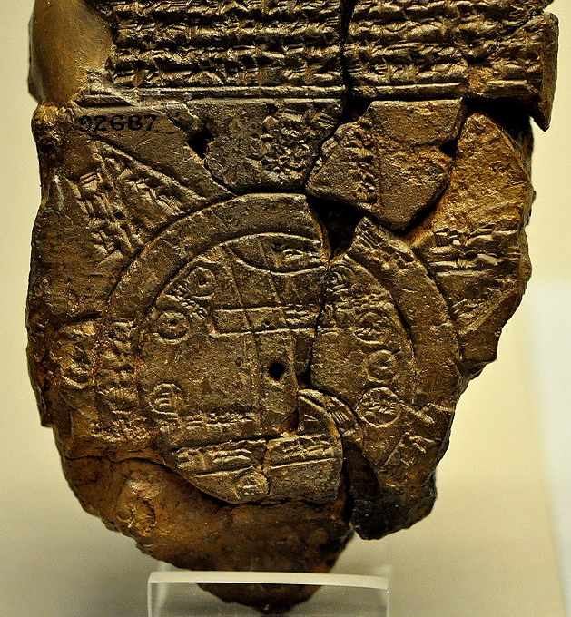

\nocite{monmonier_how_2018}

# (PART) Cartography {-}

`r geovizr::chapter_image("../Resources/pictures/Cartography/1__head")`
# A short history

> *Hic sunt dracones*
>
> `r tufte::quote_footer('--- Unknown cartographer')`

## The first maps

There are many different prehistoric maps and it is difficult to say which one is the oldest. The petroglyph of Bedolina is a possible candidate (see chapter image). It's an engraved rock showing what could be a map of the surroundings village. Some parts probably date back to the end of the Bronze Age (3000-1000 [bce]{.smallcaps}). It isn't certain that the depiction is an actual map or just an artist's creation.

The Babylonian map of the World (see figure \@ref(fig:carto-babylonian-world-map)) is the oldest map of the "world". It shows the known world from the perspective of the Babylonians. It probably dates back to the 5^th^ Century [bce]{.smallcaps}. The representation on the map is most likely partly mythological (edges of the map). The stone slab also features a text that explains the different elements shown on the map.

(ref:carto-babylonian-world-map-cap) The Babylonian Map of the World. Source: [Wikimedia](https://commons.wikimedia.org/wiki/File:The_Babylonian_map_of_the_world,_from_Sippar,_Mesopotamia..JPG).

```{r carto-babylonian-world-map, opts.label='fig.half', fig.align='center', fig.cap='(ref:carto-babylonian-world-map-cap)'}

```

## The Greeks

In Ancient Greece, two scholars have had an important impact on the history of cartography: Eratosthenes and Ptolemy.

### Eratosthenes

I already mentioned Eratosthenes in the introduction chapter. He was a scholar who focused on the world around him and its description. He certainly worked with maps but no document featuring a map by Eratosthenes has survived. He is, however, credited for a map of the world which was the foundation for most world maps in the centuries to come. Among other achievements, his measure of Earth's circumference was highly accurate for the time.

### Ptolemy

Ptolemy was the first scholar to map Europe extensively. His great achievement was to write down his topological data as a collection of places and coordinates in his book called *Geographia*. This work allowed cartographer in the 14^th^ and 15^th^ to produce maps of the world using only the knowledge written there.

## The Middle Ages

From the 5^th^ to the 14^th^ Century, the improvements in cartography were scarce and world maps were more likely to mirror the predominant religious ideas than strive for accuracy. One example of such a religious map of the world is the quite common T-O map (see picture \@ref(fig:carto-to-map)). This map showed the world in a circle, much like the Babylonian one, with an ocean surrounding a flat earth. The upper half of the circle showed Asia, the lower left corner Europe and the lower right Africa. At the centre of the map there's Jerusalem, the place where Jesus was crucified (hence the T-shape in the map associated with the cross). The T-O map is useless if you want to navigate the world as all the land and sea are warped to fit the circle and T division.

(ref:carto-to-map-cap) Hereford Mappa Mundi (ca. 1300). Source: [Wikimedia](https://commons.wikimedia.org/wiki/File:Hereford_Mappa_Mundi_1300.jpg).

```{r carto-to-map, opts.label='fig.half', fig.align='center', fig.cap='(ref:carto-to-map-cap)'}
knitr::include_graphics("../Resources/pictures/Cartography/1_hereford_mappa.jpg")
```

## The Renaissance

With the Renaissance comes a golden age for cartography. The knowledge gathered by Greek scholars like Ptolemy is used to recreate maps of Europe, Asia and Africa. The every growing knowledge about the world is used to push the blanks at the edges of the map farther and farther out.

Many cartographers have played an important role during the 15^th^ and 16^th^ centuries. I will focus on two that have made a major impact on the field of cartography: Gerardius Mercator and Abraham Ortelius.

### Gerardius Mercator

Gerardius Mercator is, arguably, the most famous cartographer of all time. During the 16^th^ his world maps and globes are a great success and help pay for a good part of his research. He is, however, mainly remembered for his *Mercator* projection which is the first conformal projection (see chapter \@ref(projections)). Straight lines on the map are lines of constant bearing, this allows for much better navigational charts.


### Abraham Ortelius

Abraham Ortelius is a pupil of Gerardius Mercator. He travelled Europe extensively and used his knowledge along with many different sources to produce the first modern atlas. He published it in 1570 under the title *Theatrum Orbis Terrarum*. It featured 53 beautiful maps and was an immediate success. During his lifetime, Ortelius would publish twenty-five different editions and more were published after his death.

`r geovizr::chapter_image("../Resources/pictures/Cartography/2__head")`
# Projections

> *A map is the greatest of all epic poems. Its lines and colours show the realization of great dreams.*
>
> `r tufte::quote_footer('--- Gilbert H. Grosvenor')`

## How to flatten a sphere?

The problem of projection is as old as maps themselves. When making a map, the cartographer tries to put the surface of a sphere onto a flat two-dimensional surface. This process, called *projection* inevitably lead to some distortions. There are hundreds of different projections. Some are widely used, some have very specific uses and some are just fancy mathematical experiments.

## The different types of projections

There are three main types of projections (see figure \@ref(fig:carto-projection-types)):

- azimuthal projections
- conical projections
- cylindrical projections


Depending on the type of projection used, the resulting projection will have a different shape.

(ref:carto-projection-types-cap) From left to right: azimuthal, conical and cylindrical projections. Source: @battersby_map_2017

```{r carto-projection-types, opts.label='fig', fig.cap='(ref:carto-projection-types-cap)'}
knitr::include_graphics("../Resources/pictures/Cartography/2_projection_types.png")
```

Different projections have different properties. I will focus on three of those properties: *conformal*, *equivalent* and *compromise*. Those properties are mutually exclusive. A conformal map cannot be equivalent. A compromise is a map that is neither conformal nor equivalent.

A conformal map tries to conserve the angles of the shapes as they appear on a globe. The result is a rather pleasing looking map. The areas that are farthest away from the central point of projection are often highly distorted. An example of conformal map would be the Mercator projection.

An equivalent projection tries to conserve the proportional surfaces of the shapes of the globe. This always results in distorted shapes but their area compared with one another is proportional. Examples of equivalent projections are the Gall-Peters and Hobo-Dyer projection.

A compromise is a projection which tries to do its best to look aesthetically pleasing while at the same time minimizing the area distortions. There are a large number of examples for such projections.

```{r carto-rectangular-projections, opts.label='fig', fig.cap='Rectangular cylindrical projections. From left to right and top to bottom: Plate carrée, Mercator, Gall-Peters and Hobo–Dyer projections.'}
geographer::df_cartography_rectangular_projections()
```

```{r carto-non-rectangular-projections, opts.label='fig', fig.cap='Non-rectangular projections. From left to right and top to bottom: Goode homolosine, Robinson, Winkel-Tripel and Equal-earth projections.'}
geographer::df_cartography_nonrectangular_projections()
```

### Plate carrée

This cylindrical compromise projection (see figure \@ref(fig:carto-rectangular-projections)) is probably the oldest projection. It certainly is the simplest projection. In this projection, the latitude and longitude coordinates map to x and y coordinates on the map. There is no mathematical transformation involved. This makes it a very easy-to-use projection, hence its large adoption in computer applications.

### Mercator

For centuries, the Mercator projection was the star of projections (see figure \@ref(fig:carto-rectangular-projections)). It is a conformal cylindrical projection which conserves the shapes of the continents. This gives this projection an appealing appearance. It is, however, exaggerating the size of the land mass as you move away from the equator. A frequently used example is that of Greenland which look as large as Africa, where Africa is fourteen times larger than Greenland.

### Gall-Peters

The Gall Peters projection is an abomination! It is a very ugly cylindrical equal-area projection. Arno Peters, the author of this projection, is a somewhat controversial figure in cartography. He promoted his projection with claims of "total distance fidelity", "absolute angle conformality" and "no extreme distortions". While the first two are down right lies, the last one is, to the very least, highly debatable.

### Hobo-Dyer

The Hobo-Dyer projection is a cylindrical equal-area projection similar to the Gall-Peters. It uses the same process as the Gall-Peters and is therefore also equal-area. The distortions are distributed in a slightly different way, making it a good alternative to the Gall-Peters as most shapes are less stretched along the longitudes.

### Goode homolosine

The Goode homolosine is a pseudo-cylindrical equal-area projection (see figure \@ref(fig:carto-non-rectangular-projections)). It cuts the edges of the map down to the equator in several places. This allows for smaller distortions in the shapes of the continent.

### Robinson

The Robinson projection is a pseudo-cylindrical compromise projection (see figure \@ref(fig:carto-non-rectangular-projections)). It is one of the most used world map projections. The Robinson projection uses a table of parameters to translate polar coordinates into Cartesian ones.

### Winkel tripel

The Winkel tripel projection (also called Winkel III) is a pseudo-azimuthal compromise projection (see figure \@ref(fig:carto-non-rectangular-projections)). This projection uses a complex mathematical formula to translate polar coordinates into Cartesian ones. These formulas are not reversible.

### Equal-Earth
The Equal-earth projection is a fairly recent projection (2018) (see figure \@ref(fig:carto-non-rectangular-projections)). It is inspired by the Robinson projection but unlike the Robinson, the Equal-earth projection is equal-area.

`r geovizr::chapter_image("../Resources/pictures/Cartography/3__head")`
# Types of maps

> *I am told there are people who do not care for maps, and I find it hard to believe.*
>
> `r tufte::quote_footer('--- Robert Louis Stevenson')`

## Maps as tools

Today we use maps everywhere, in our phones, our cars. Cartography has become a very large industry serving a wide variety of different purposes. The use of maps has evolved since the time of Eratosthenes but they are still as important a tool. This reliance on the map as a representation of "reality" also makes it a very powerful instrument; one which can be used and abused as a weapon for propaganda.

## The different types of maps

There are many different types of maps and it would be impossible to make an exhaustive list here. The following are the most common types of maps you can find.

### Topographical maps

Topographical maps show the surface of the Earth as accurately as possible using a number of different symbols, lines and shapes. They are quite common for outdoor activities. Switzerland has some of the most accurate topographical maps in the world.

### Political maps

Political maps are referenced maps used to show the borders between different governmental bodies (countries, counties, etc.). Political maps usually sacrifice accuracy to show some type of information more clearly. Different countries are filled with different colours, for example. Political maps can also be used to promote a certain political position.

### Thematic maps

Thematic maps include all maps that show a certain type of information with a geographic component. They are used to display some type of information (usually some statistical indicator).
