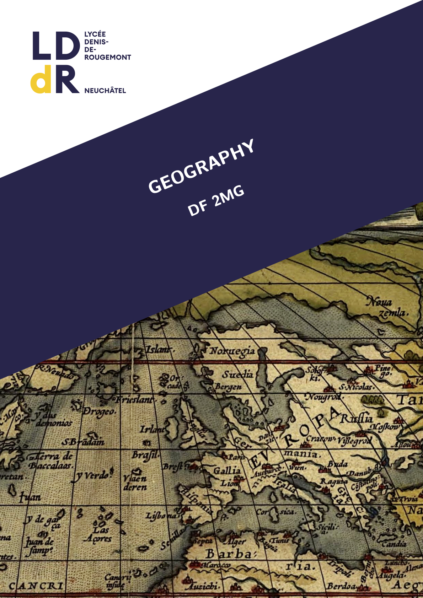

--- 
title: "Geography"
subtitle: "DF 2MG"
language: "english"
author: "Pascal Burkhard"
date: "`r Sys.Date()`"
site: bookdown::bookdown_site
cover_image: "../Resources/pictures/General/0-cover.png"
main_color: "0F2D61"

documentclass: book
bibliography: [../Resources/bibliographies/main.bib]
biblio-style: apalike
link-citations: yes
description: "Course book for the DF Geography lessons."

latex_book:
  chapter_image: true
  bibliography: true
  index: true
  toc_image: "../Resources/pictures/General/0-toc.pdf"
  bib_image: "../Resources/pictures/General/0-biblio.pdf"
  index_image: "../Resources/pictures/General/0-index.pdf"
---

```{r setup, echo=FALSE, message=FALSE, warning=FALSE}
geotools::gtl_opt_set_i18n("en_CH")
geotools::gtl_options("book_resources" = "inst/Resources")
geovizr::gvz_global_opts_chunk()

options(tinytex.engine = 'xelatex')
options(bookdown.post.latex = function(x) {
    from <- grep("usepackage\\{amsthm\\}", x)
    to <- grep("newtheorem\\*\\{solution", x)
    x <- x[-c(from:to)]
  })
```

`r if (knitr::is_latex_output()) '<!--'`

# Welcome {.unnumbered}

<a href="DF-Geo.pdf" download></a> Welcome to the companion website for the course book for the DF Geography.

The <a href="DF-Geo.pdf" download>PDF version</a> of this book can be downloaded. The content of the PDF version is the same as for the website with some small exceptions: some content of the website is dynamic and allows for interaction where the PDF version is static.

The entire book is a work in progress, don't hesitate to report any mistakes or inaccuracies you might spot! 

`r if (knitr::is_latex_output()) '-->'`
