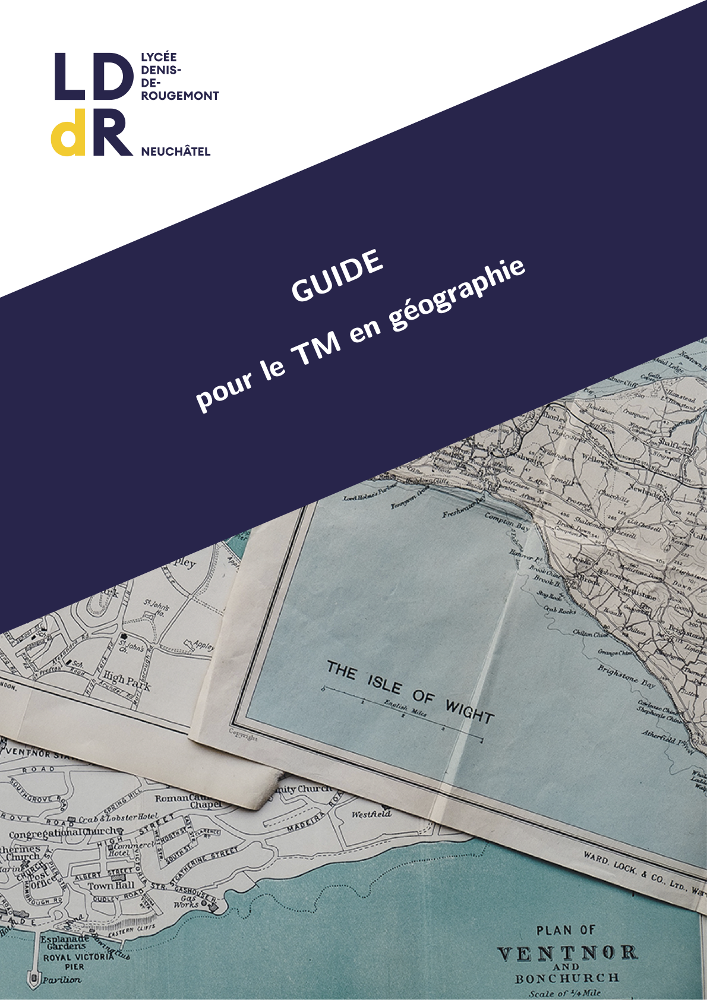

--- 
title: "Guide"
subtitle: "pour le TM en Géographie"
language: "french"
author: "Pascal Burkhard"
date: "`r Sys.Date()`"
site: bookdown::bookdown_site
cover_image: "pictures/0-cover.pdf"
main_color: "0f3b06"

documentclass: book
bibliography: [../Resources/bibliographies/main.bib]
biblio-style: apalike
link-citations: yes
description: "Guide destiné aux étudiant·e·s qui font un travail de maturité en géographie."

latex_book:
  bibliography: true
---

```{r setup, echo=FALSE}
knitr::opts_chunk$set(
  echo = FALSE,
  warning = FALSE,
  results = 'asis'
)
options(tinytex.engine = 'xelatex')

withr::with_locale(
  new = c("LC_TIME" = "fr_CH"),
  code = {
    deadline <- list(
      first_review =        "mi mai",
      preliminary_version = format(lubridate::ymd("2022-06-27"), "%d %B %Y"),
      complete_version =    format(lubridate::ymd("2022-08-31"), "%d %B %Y"),
      second_review =       "mi septembre",
      final_version =       format(lubridate::ymd("2022-09-20"), "%d %B %Y"),
      reddition =           format(lubridate::ymd("2022-10-19"), "%d %B %Y")
    )
  }
)
```

`r if (knitr::is_latex_output()) '<!--'`

# Bienvenue {.unnumbered}

<a href="GuideTM.pdf" download></a> Bienvenue sur le site du <em>Guide pour le TM en géographie</em>. Ce site reprend les informations qui se trouvent dans la <a href="GuideTM.pdf" download>version PDF</a>.

La version actuelle de ce guide est destinée aux étudiant·e·s de la session 2022.

<div style="height: 100px;"></div>


`r if (knitr::is_latex_output()) '-->'`
